# Avaliação do fluxo Pixel Hop sob quatro perspectivas

Data da avaliação: 20 de julho de 2026

## 1. Escopo e método

Esta avaliação cobre:

1. pré-SDD sob a perspectiva de Product/UX Design;
2. SDD sob a perspectiva de arquitetura de software;
3. pós-SDD sob a perspectiva de Growth;
4. governança de custo e consumo de tokens de ponta a ponta.

A análise foi feita por leitura estática do lifecycle, workflows, templates, schemas, configuração, ferramentas e documentação. Três agentes trabalharam em paralelo nas perspectivas de design, arquitetura e growth; a análise de custos e a consolidação foram feitas separadamente.

Nenhuma rule ou workflow de SDD foi executado. Também não foram executados comandos SDD, testes, lint do framework ou validações de artefatos. As rules não foram usadas como método para produzir esta análise.

Prioridades usadas:

- **P0:** risco de decisão, autorização ou execução incorreta; corrigir antes de ampliar o fluxo.
- **P1:** gap relevante de qualidade, aprendizado ou eficiência.
- **P2:** melhoria incremental, extensibilidade ou redução de atrito.

## 2. Resumo executivo

O framework é conceitualmente forte. Ele separa discovery, especificação e release; preserva histórico; exige aprovações vinculadas a conteúdo; trata `STOP` como aprendizado válido; diferencia planejamento de autorização; e evita escalar growth sem measurement e economia downstream.

O principal problema não é falta de processo. É a combinação de três desequilíbrios:

1. **pré-SDD forte em desk research, viabilidade e lojas, mas fraco em evidência direta de usuário e usabilidade;**
2. **SDD com bom contrato documental, mas enforcement incompleto ou divergente no tooling;**
3. **pós-SDD maduro em planejamento, porém com candidato, experimentos e métricas ainda insuficientemente estruturados.**

Em custo, o framework já possui boas ideias — contexto seletivo, perfis adaptativos, reutilização por hash, regressão ampla uma vez e escolha do modelo de menor capacidade adequada. Entretanto, não mede tokens nem custo real, não impõe orçamento, relê contexto estável, acumula ledgers sem estratégia incremental e contém uma divergência que pode promover validação final ao modelo mais caro por padrão.

### Diagnóstico consolidado

| Perspectiva | O que está forte | Principal gap |
| --- | --- | --- |
| Product/UX | filtro de investimento, falseabilidade, economia, escopo e risco de loja | ausência de customer discovery e teste de conceito/usabilidade como gate |
| Arquitetura | lifecycle explícito, hashes, cobertura, claims, evidência e validação adaptativa | tooling não garante integralmente o contrato documentado |
| Growth | readiness, GTM, measurement, economia unitária, gates e segurança de escala | candidato/experimentos/snapshots pouco estruturados e feedback fraco para discovery |
| Custos | seleção lowest-adequate e validação proporcional | ausência de telemetria, budgets, contexto incremental e política de compactação |

### Prioridades transversais

| Ordem | Prioridade | Mudança | Resultado esperado |
| ---: | --- | --- | --- |
| 1 | P0 | corrigir parser de `(P)`, claims, evidência de conclusão e invalidação atômica | impedir execução ou conclusão incoerente |
| 2 | P0 | vincular candidato e escopo ao launch gate | garantir que a aprovação se aplique ao build que será lançado |
| 3 | P0 | criar contratos estruturados para evidência de usuário, métricas e experimentos | tornar decisões auditáveis e machine-checkable |
| 4 | P0 | exigir problem/concept validation proporcional ao risco | evitar `GO` baseado apenas em coerência documental |
| 5 | P1 | unificar schema, lint e estados derivados | reduzir divergência entre semântica e enforcement |
| 6 | P1 | introduzir governança de tokens, manifestos e leitura por delta | reduzir custo sem retirar gates de qualidade |
| 7 | P1 | formalizar handoffs discovery → SDD e growth → discovery | fechar o ciclo de aprendizado |
| 8 | P2 | modularizar templates e perfis por aplicabilidade/risco | eliminar preenchimento cerimonial |

## 3. Perspectiva de Product/UX Design: pré-SDD

### 3.1 Onde o fluxo é útil no discover

O pré-SDD funciona bem como **filtro de investimento** para um produto mobile indie de baixa capacidade operacional.

Pontos fortes:

- um `GO` torna a descoberta elegível para promoção, mas não transforma suas conclusões em requisitos aprovados (`.sdd/settings/lifecycle.md`);
- `STOP` é um resultado válido, reduzindo sunk cost e viés de continuidade;
- o brainstorm começa por capacidade, orçamento, plataformas, dependências e risco;
- a validação exige critérios de falseamento, concorrentes, substitutos e evidência contrária;
- o business case explicita premissas, cenários, break-even e custo de oportunidade;
- o product outline cobre primeiro valor, onboarding, core loop, monetização, retenção, confiança, falhas, acessibilidade, release slices e kill thresholds;
- a decisão final continua humana;
- riscos de Apple e Google são avaliados separadamente, evitando transportar critérios de uma loja para outra.

Esse conjunto é especialmente útil para impedir que uma ideia tecnicamente atraente consuma capacidade antes de demonstrar coerência de mercado, econômica e operacional.

### 3.2 Gaps prioritários

#### P0 — customer discovery não é parte explícita do fluxo

`discovery-validate` e `market-validation.md` privilegiam pesquisa web, concorrência, preços, distribuição e políticas. Não há contrato explícito para:

- entrevistas de problema;
- observação contextual;
- dados comportamentais de um produto existente;
- recrutamento e perfil da amostra;
- frequência, intensidade e contexto da dor;
- solução atual e forças que impedem a troca;
- síntese de padrões, exceções e vieses;
- evidência qualitativa protegida.

Uma categoria ativa pode demonstrar mercado, mas não valida que o recorte selecionado tenha uma dor relevante. O fluxo deveria distinguir:

- `desk_only`;
- `primary`;
- `mixed`.

Um `GO` baseado apenas em desk research deve carregar confiança limitada e uma condição explícita de validação.

#### P0 — o ledger de fontes não representa evidência de usuário

O schema de research source exige URL HTTP(S). Isso não modela adequadamente entrevista, teste de protótipo, survey, analytics interno, ticket de suporte ou observação.

Recomendação: evoluir de “source ledger” para um **evidence ledger** com:

- `evidence_id`;
- `evidence_type`;
- `method`;
- `provenance`;
- `captured_at`;
- participante/coorte anonimizada;
- claim e direção;
- confiança e limitações;
- referência opcional;
- política explícita para manter dados identificáveis fora do ledger.

#### P0 — não há ledger transversal de hipóteses

Hipóteses e suposições ficam espalhadas por constraints, brainstorm, market validation, business case e product outline.

Criar `assumptions.jsonl` ou equivalente com:

- ID estável;
- categoria: desirability, viability, feasibility, usability, distribution ou compliance;
- impacto e incerteza;
- evidência atual;
- teste e limiar;
- custo/tempo máximo;
- estado;
- iteração;
- validade temporal.

O gate deve bloquear suposições **críticas** abertas, não todo desconhecido.

#### P0 — o produto pode ficar `ready` sem teste de conceito ou usabilidade

O product outline menciona uma validation prototype como release slice, mas o workflow não exige sua criação ou teste antes do `GO`.

Aplicar validação proporcional:

| Risco | Evidência mínima |
| --- | --- |
| conhecido e reversível | walkthrough crítico ou teste de compreensão |
| interação nova | protótipo executável por tarefas |
| confiança, IA, finanças, saúde ou permissões | teste de linguagem, expectativa, erro e explicabilidade |

Registrar sucesso por tarefa, problemas, severidade e mudanças resultantes.

#### P1 — Store Design Readiness tem peso desproporcional

O tema aparece no brainstorm, market validation, product outline e em JSON canônico. Isso cria:

- repetição;
- falsa precisão de scores durante ideação;
- risco de divergência Markdown/JSON;
- consumo de tokens;
- otimização prematura para reviewer antes de validar valor.

Usar triagem `green/yellow/red/unknown` no brainstorm e manter o score completo apenas quando plataforma e conceito estiverem definidos. `store-design-score.json` deve ser a fonte canônica; outros artefatos devem referenciar verdict e hard flags.

#### P1 — a sequência é excessivamente linear

Mercado, economia e experiência influenciam-se. Um protótipo barato pode invalidar a hipótese antes de um business case completo.

Criar dois perfis:

- `rapid`: framing, risco principal, teste barato e decisão;
- `full`: evidência primária, protótipo, business case e avaliação completa.

#### P1 — falta problem framing antes do ranking de soluções

O brainstorm rapidamente compara soluções, monetização e feasibility. Antes disso, deveria registrar:

- jornada atual;
- comportamento observado;
- job/outcome;
- frequência e severidade;
- workarounds;
- switching forces;
- oportunidade separada da solução.

#### P1 — handoff para SDD perde semântica

Registrar apenas a proveniência da discovery preserva separação de autoridade, mas força requisitos a reconstruírem contexto.

Criar `promotion-brief.md`, sem autoaprovação, mapeando:

`outcome/flow/condition/evidence → requirement candidate ou open decision`.

O handoff deve preservar também métricas, kill thresholds, non-goals e condições do business case.

### 3.3 Desperdícios no pré-SDD

- score de loja repetido em várias fases;
- decisão relendo todos os artefatos quando hashes e deltas bastariam;
- business case completo antes de um teste barato em hipóteses frágeis;
- scores numéricos com evidência insuficiente;
- pergunta única por turno até para dados administrativos independentes;
- hipótese, risco, teste e métrica repetidos sem IDs estáveis.

### 3.4 Métricas recomendadas

- tempo até a primeira evidência de usuário;
- custo/horas até `GO`, `PIVOT` ou `STOP`;
- custo por suposição crítica resolvida;
- percentual de claims decisivos com evidência primária;
- suposições críticas abertas no `GO`;
- sucesso por tarefa e tempo até primeiro valor no protótipo;
- churn de requisitos causado por gaps de discovery;
- diferença entre ativação/retenção/conversão previstas e observadas;
- pesquisas repetidas após promoção.

## 4. Perspectiva de arquitetura de software: SDD

### 4.1 Pontos fortes

O fluxo central tem boas propriedades:

- requisitos, design, tarefas, implementação e validação possuem estados separados;
- aprovações são vinculadas a hashes;
- mudança upstream invalida decisões downstream;
- critérios têm IDs e cobertura explícita;
- claims coordenam write scopes;
- evidência durável separa `passed`, `failed` e `partial`;
- discovery e release não contaminam o estado da spec;
- auto-SDD possui gate manual antes de implementação;
- validação lean/standard/critical tenta ser proporcional ao risco.

O maior gap é que parte dessas garantias existe no contrato, mas não é imposta de forma consistente pela ferramenta.

### 4.2 Defeitos P0 de compatibilidade e enforcement

#### P0 — `(P)` oficial não é reconhecido pelo parser

O template de tarefas coloca `(P)` ao fim da descrição, enquanto `parseTaskRecords` o reconhece imediatamente após o ID (`.sdd/settings/templates/specs/tasks.md` versus `.sdd/tools/sdd.mjs`).

Efeito: tarefas geradas no formato canônico podem ser interpretadas como não paralelas, desperdiçando concorrência e alterando wave planning.

Correção:

- aceitar o sufixo canônico;
- aceitar temporariamente ambos os formatos;
- normalizar na escrita;
- adicionar fixtures de parsing e planejamento de waves.

#### P0 — claims convencionais não garantem o contrato de `spec-impl`

O workflow exige tarefa existente, tarefas aprovadas, IDs explícitos e write scope declarado. Fora de auto-SDD, o helper de claim não aplica todas essas condições.

Correção:

- exigir task ID existente;
- exigir estado aprovado e transição legal;
- comparar write scope com o plano;
- aplicar essas garantias em todo claim;
- fazer auto-SDD acrescentar gate, wave e attempt sem substituir o núcleo comum.

#### P0 — claim pode ser liberado com evidência inadequada

O lifecycle diz que uma tarefa só conclui quando a estratégia de verificação sucede. O fluxo convencional pode liberar claim mesmo com evidência `failed`, `partial` ou `not_run`.

Correção:

- separar `release --complete`, `--blocked` e `--abandon`;
- `--complete` exige evidência `passed`;
- vincular evidência à estratégia, revisão/commit e task atual;
- impedir que release de coordenação seja interpretado como conclusão.

#### P0 — invalidação não é atômica fora do auto-SDD

O lint detecta hash stale, mas a transição que retorna o artefato a `review_required` e torna downstream `superseded` não é uniformemente aplicada.

Criar uma operação determinística `revise/invalidate` que:

- incremente revision;
- invalide aprovação do artefato;
- marque downstream como superseded;
- revogue gates dependentes;
- registre histórico;
- funcione nos modos convencional e auto-SDD.

### 4.3 Gaps P1

#### Estados top-level não são realmente derivados

O lifecycle define a fase como derivada, mas a validação aceita enums sem garantir combinações legais. Criar uma única função de derivação e validar `persisted == derived`.

#### Proveniência de aprovação é parcialmente validada

Um artefato approved deve exigir `approved_by`, `approved_at` e `content_hash`, tanto no schema quanto no lint.

#### Schema e lint implementam contratos diferentes

O lint não aplica integralmente os JSON Schemas. Isso cria duas fontes de validação que podem divergir.

Opções:

1. aplicar schemas no lint e manter somente invariantes semânticos no código; ou
2. gerar parte das checagens a partir dos schemas.

#### Gap analysis é um handoff órfão

`validate-gap` produz `gap-analysis.md`, mas o design não exige consumi-lo, nem registra o hash/revisão usada.

O design deveria:

- carregar o gap analysis quando presente;
- registrar seu hash;
- mapear capacidades reutilizadas, lacunas e decisões;
- invalidar conclusões quando código ou baseline material mudar.

#### Rastreabilidade é duplicada

Design, tasks, coverage e validation repetem mapeamentos, mas apenas parte é verificada.

Adotar uma matriz canônica machine-readable e renderizar visões Markdown, ou ao menos gerar as tabelas derivadas.

#### `tasks.md` mistura plano e estado operacional

Checkboxes, dependências, scope e `(P)` dependem de regex e formatação Markdown.

Evolução recomendada:

- `tasks.json` como ledger canônico;
- `tasks.md` como visão humana gerada;
- migração aditiva para preservar compatibilidade.

#### Status entrega menos que o contrato promete

O status deveria calcular effective phase, hashes stale, blockers, claims e próxima transição legal, não apenas exibir o estado persistido.

#### Paridade de adapters é assimétrica

Claude recebe verificação de referências; Codex recebe principalmente verificação de existência da skill. Adicionar testes de conteúdo e comportamento equivalente.

#### Lock de claims não possui recuperação segura

Adicionar metadata de owner/process/session, timestamp, TTL e uma operação explícita/auditável de recuperação de lock órfão.

### 4.4 Desperdícios no SDD

- `design.md` amplo demais para mudanças lean;
- `research.md` e `design.md` repetem alternativas, riscos e decisões;
- review convencional não persiste provenance reutilizável equivalente a auto-SDD;
- wave overflow cria ondas adicionais sem explicitar dependência operacional;
- documentos Markdown são relidos integralmente para decisões que poderiam usar índices e deltas;
- schema, lint e parser duplicam semântica.

Definir ownership:

- research guarda evidência, alternativas e incerteza;
- design guarda contrato e decisão final, referenciando research;
- task ledger guarda planejamento/estado;
- validation guarda somente resultado e evidência derivada.

### 4.5 Métricas recomendadas

- specs com combinações ilegais de estado;
- approvals stale ou sem proveniência;
- critérios sem evidência passada;
- ciclos de correção por artefato;
- tempo bloqueado em gate/claim;
- defeitos pós-validação por requisito;
- conflitos de scope;
- tarefas `(P)` efetivamente paralelizadas;
- falhas de parsing Markdown;
- claims/locks órfãos;
- divergências schema/lint;
- diferenças de adapter detectadas em teste.

## 5. Perspectiva de Growth: pós-SDD

### 5.1 Pontos fortes

O pós-SDD possui uma filosofia de growth saudável:

- readiness antecede tráfego;
- measurement antecede mídia paga;
- publicação e spend possuem gates humanos separados;
- upload ou aprovação não são confundidos com disponibilidade real;
- analytics, lojas, ads, backend, refunds e finanças devem ser reconciliados;
- decisões usam coortes, downstream value, contribuição e incrementality;
- retenção, confiabilidade e valor são priorizados antes de mais aquisição;
- perdas e resultados inconclusivos são preservados;
- mudança de produto retorna ao SDD.

Cobertura qualitativa:

| Dimensão | Maturidade |
| --- | --- |
| Readiness e segurança de lançamento | forte |
| GTM e economia unitária | forte |
| Instrumentação e qualidade de dados | forte |
| Aquisição, ativação, retenção e receita | forte |
| Experimentação | intermediária |
| Referral e reativação | parcial |
| Feedback para discovery | fraco |

### 5.2 Gaps P0

#### P0 — candidato e escopo não estão vinculados ao launch gate

O lifecycle e `release-init` exigem candidato imutável, specs, mercados/locales, capacidade e budget. Entretanto, `release.json` persiste principalmente versão, specs e plataformas. O gate hasheia cinco documentos, mas não o build/commit/artifact aprovado.

Adicionar:

```text
candidate:
  commit
  version
  build
  artifact_digest
  environment
  verified_at

scope:
  platforms
  storefronts
  markets
  locales
```

Vincular `candidate_digest` e `scope_digest` ao launch gate e revogá-lo quando qualquer um mudar.

#### P0 — paid-media gate não contém todo o contrato

O lifecycle requer stop rules, mas o schema cobre canal, moeda, cap e datas.

Adicionar:

- experiment/campaign IDs;
- objetivo e conversion event;
- stop rules;
- timezone;
- spend committed/actual/remaining;
- motivo de pause/exhaustion.

#### P0 — métricas e experimentos não possuem schemas

`metrics-snapshots.jsonl` e `experiments.jsonl` sustentam decisões críticas, mas não têm contrato machine-readable.

Snapshot mínimo:

- window/snapshot ID;
- release/candidate;
- source e extraction time;
- timezone/latency;
- cohort e dimensions;
- counts, denominators e rates;
- currency;
- missingness/data quality;
- baseline;
- uncertainty.

Experimento mínimo:

- experiment ID, owner e status;
- hipótese e decision owner;
- vínculo a release/spec/candidate;
- eligibility e exposure unit;
- assignment method;
- control/variant digests;
- primary metric e guardrails;
- duração/amostra mínimas;
- spend/capacity;
- stop rule;
- resultado, incerteza, efeitos por segmento e aprendizado.

### 5.3 Gaps P1

#### Referral e reativação não são etapas explícitas

Referral aparece como canal/loop, mas não integra a árvore obrigatória de métricas. Reativação aparece como categoria de experimento, sem contrato de elegibilidade, consentimento, frequência, opt-out e incremento.

Adicionar, quando aplicável:

- eligible → share/invite → accepted → activated → retained/revenue;
- resurrection/reactivation;
- impacto incremental de push/email/in-app;
- opt-out, complaints e notification disable;
- fraude, canibalização e qualidade da coorte referida.

#### O feedback de growth não retorna formalmente a discovery

Mudanças comportamentais retornam ao SDD, mas aprendizados que invalidam ICP, problema, proposta, willingness to pay ou business case não têm destino formal.

Criar roteamento:

| Aprendizado | Destino |
| --- | --- |
| operacional/reliability | release/readiness |
| canal, mensagem ou creative | marketing/assets |
| comportamento do produto | nova spec SDD |
| ICP, problema, tese ou economia | nova iteração de discovery |
| insight transversal validado | índice derivado de aprendizados |

#### Rigor experimental deve ser proporcional

Usar três perfis:

- `directional`: baixo tráfego e decisão reversível;
- `controlled`: holdout/randomização e tamanho mínimo;
- `high-risk`: pricing, privacy ou spend relevante, com desenho estatístico completo.

Nos perfis superiores, explicitar unidade de exposição, SRM, MDE/power, peeking, carryover, múltiplas comparações e intent-to-treat.

#### `growth.complete` não possui critério de conclusão

Definir conclusão quando:

- não há experimento ou spend aberto;
- resultados e decisões estão persistidos;
- follow-ups têm owner e destino;
- budget está reconciliado;
- janela mínima de observação terminou;
- não há alerta sem disposition.

### 5.4 Desperdícios no pós-SDD

- candidato, escopo, owner, budget e audience repetidos em vários documentos;
- launch e status carregam todos os artefatos;
- ledgers append-only crescem sem cursor ou rollup;
- marketing, assets e growth repetem pesquisa mutável;
- templates completos são preenchidos mesmo quando módulos não se aplicam;
- aprendizados ficam fragmentados por release.

### 5.5 Métricas recomendadas

- listing conversion por storefront/locale/source;
- ativação e p50/p90 de time-to-value;
- retenção por coorte e retained activation;
- reativação incremental;
- trial-to-paid, renewal, churn e refund;
- contribuição, CAC e payback por coorte;
- referral acceptance, activation e qualidade;
- data latency, missingness e reconciliation delta;
- tempo de `measurement ready` até primeira decisão;
- tempo de resultado até encaminhamento para release/SDD/discovery;
- custo por aprendizado acionável.

## 6. Governança de custo e tokens

### 6.1 O que já reduz custo

O framework já prevê:

- leitura de seções relevantes em vez de documentos inteiros (`workflows/_common.md`);
- contexto por profiles;
- pacotes bounded para executores;
- seleção de modelo `lowest-adequate`;
- perfis lean/standard/critical;
- reutilização de review por hash;
- batch de waves independentes;
- uma regressão ampla final, em vez de repetição por wave;
- reutilização do wave validator como final no perfil lean.

Esses princípios devem ser preservados.

### 6.2 Gaps de governança

#### P0 — política e template divergem sobre o modelo final

A regra de auto-SDD estabelece:

- `advanced` para final validation lean/standard;
- `frontier` para critical.

Mas `.sdd/settings/templates/specs/auto-sdd.json` nasce com:

- capability `frontier`;
- rationale de usar o modelo mais forte.

Isso contradiz a seleção lowest-adequate e pode elevar custo por default.

Correção: iniciar como `pending` e derivar capability somente depois da seleção do validation profile. Adicionar teste que compare template, regra, schema e configuração.

#### P0 — não há budget nem telemetria de tokens

`cost_rank` é ordinal. Ele não informa preço, tokens usados ou custo acumulado. Não existem:

- budget por spec/release/fase;
- limite de tokens por agente;
- custo previsto versus realizado;
- alerta de desvio;
- custo por correção;
- regra de escalonamento ao usuário.

Adicionar uma política:

```text
token_governance:
  soft_budget
  hard_budget
  currency
  max_input_tokens_per_agent
  max_output_tokens_per_agent
  max_pre_impl_corrections
  max_research_refreshes
  warn_at_percent
  require_approval_at_percent
```

Hard budget não deve encerrar silenciosamente validação crítica. Deve bloquear com diagnóstico e pedir decisão.

#### P1 — catálogo Codex não tem modelo routine

Na configuração exemplo, Codex possui apenas advanced e frontier. Trabalho routine será roteado para advanced mesmo quando um modelo mais barato puder atendê-lo.

Adicionar candidato routine quando suportado pelo runtime e manter avaliação periódica de qualidade por classe de tarefa.

#### P1 — `cost_rank` não representa custo real

Persistir, quando disponível:

- preço por milhão de tokens de entrada, cache e saída;
- região/provider;
- data de vigência;
- custo estimado;
- custo realizado;
- capability benchmark;
- taxa de retrabalho.

O menor preço por chamada não é necessariamente o menor custo por resultado. A seleção deve usar **lowest adequate expected total cost**, considerando retrabalho.

#### P1 — correction loops pré-implementação não têm limite explícito

Requirements, design e tasks podem repetir até `GO`; a configuração limita correções por wave, mas não deixa claro um teto equivalente antes do gate.

Adicionar:

- máximo por artefato;
- bloqueio quando findings se repetem;
- escalonamento quando a correção exige decisão de produto;
- registro do motivo de cada nova tentativa.

### 6.3 Estratégia de contexto

#### Manifesto de contexto

Criar um manifest por discovery/spec/release:

```text
artifact
hash
updated_at
status
section_index
summary
dependencies
last_review_context_hash
```

O agente carrega primeiro o manifest e abre conteúdo integral somente quando:

- hash mudou;
- seção é diretamente relevante;
- gate exige auditoria completa;
- resumo é insuficiente.

#### Validação delta-first

Manter a auditoria integral nos gates que exigem rastreabilidade, mas usar:

1. diff do artefato;
2. seções dependentes;
3. IDs de requisitos afetados;
4. live code relacionado;
5. fallback para full read.

Reutilização deve ser vinculada a:

`artifact_hash + context_hash + validator_contract_version`.

#### Ledgers append-only com leitura incremental

Preservar o ledger bruto, mas adicionar:

- cursor/offset;
- índice por ID/coorte/experimento;
- rollup atual derivado;
- hash do último evento processado;
- compact summary verificável.

Status e monitor devem ler eventos novos e o rollup, não todo o histórico.

#### Freshness de pesquisa

Adicionar a claims mutáveis:

- `fresh_until`;
- market/platform/topic;
- escopo de aplicabilidade;
- motivo de invalidação.

Pesquisar novamente apenas claims expirados, contestados ou afetados por mudança de escopo.

### 6.4 Modularização por risco e aplicabilidade

Os perfis de validação devem governar também a **geração**:

| Perfil | Artefatos/contexto |
| --- | --- |
| lean | núcleo obrigatório, uma wave, pesquisa mínima, sem módulos N/A |
| standard | contratos de integração e riscos aplicáveis |
| critical | segurança, migração, rollback, privacidade e validação completa |

No pós-SDD, ativar módulos por:

- plataforma;
- monetização;
- paid media;
- referral;
- lifecycle messaging;
- localization;
- commerce;
- uso de dados sensíveis.

Registrar `not_applicable` com justificativa curta em vez de gerar seções cerimoniais.

### 6.5 Telemetria recomendada

Registrar por invocation, agente, fase e modelo:

- input, cached input e output tokens;
- custo estimado/realizado;
- arquivos e seções carregados;
- percentual de contexto citado/usado;
- findings bloqueantes e aceitos;
- correções geradas;
- hash cache hit;
- resultado da validação;
- latência.

KPIs:

- tokens por artefato aprovado;
- tokens por finding útil;
- tokens por requirement entregue e validado;
- custo por `GO/PIVOT/STOP`;
- custo por experimento concluído;
- percentual de contexto estável relido;
- taxa de reutilização de reviews hash-bound;
- custo de retrabalho por modelo;
- custo por defeito escapado.

### 6.6 Hipóteses de economia a validar

As faixas abaixo são metas de experimento, não garantias:

| Mudança | Hipótese de redução |
| --- | ---: |
| manifest + delta-first | 20–40% de input tokens em revisões |
| cursor/rollup de ledgers | 40–80% em status/monitor de longa duração |
| módulos por aplicabilidade | 15–30% na geração de artefatos |
| TTL de research | 20–50% em pesquisas recorrentes |
| modelo routine + telemetry | 10–30% no custo de execução simples |
| limite/escalonamento de correction loops | redução de caudas extremas, a medir |

Qualidade deve ser monitorada por defeitos escapados, reopen rate, findings por review e decisões revertidas. Economia que piora esses indicadores não é válida.

## 7. Arquitetura-alvo do fluxo

```mermaid
flowchart LR
    A["Problem framing"] --> B["Evidence ledger + assumptions"]
    B --> C["Desk / primary / mixed validation"]
    C --> D["Concept and usability test"]
    D --> E{"GO / PIVOT / STOP"}
    E -->|"GO"| F["Promotion brief"]
    F --> G["Requirements"]
    G --> H["Design consuming gap analysis"]
    H --> I["Canonical task ledger"]
    I --> J["Claims + execution waves"]
    J --> K["Evidence-bound validation"]
    K --> L["Release candidate + scope digest"]
    L --> M["Readiness / GTM / assets / measurement"]
    M --> N["Launch gate bound to candidate"]
    N --> O["Snapshots + experiments"]
    O --> P{"Learning routing"}
    P -->|"Product behavior"| G
    P -->|"ICP / problem / economics"| A
    P -->|"Channel / creative"| M
```



Camadas transversais:

- uma única semântica para schema, lint e tooling;
- manifestos, hashes e leitura incremental;
- telemetry e budgets de tokens;
- perfis de risco/aplicabilidade;
- histórico append-only com índices derivados.

## 8. Roadmap recomendado

### Fase 1 — integridade e segurança

1. Corrigir parsing de `(P)`.
2. Fortalecer claims convencionais.
3. Separar conclusão, bloqueio e abandono de task.
4. Implementar invalidação atômica.
5. Vincular candidate/scope ao launch gate.
6. Completar paid-media gate.
7. Criar schemas de metrics snapshots e experiments.
8. Corrigir o default frontier de final validation.

Critério de saída: não existem caminhos conhecidos para paralelismo perdido, conclusão sem evidência passada ou aprovação de release desvinculada do candidato.

### Fase 2 — fechar os loops de aprendizado

1. Evidence ledger generalizado.
2. Assumption ledger.
3. Problem validation e concept/usability validation proporcionais.
4. Promotion brief.
5. Gap analysis hash-bound e consumido pelo design.
6. Learning routing growth → SDD/discovery.
7. Referral e reactivation condicionais.
8. Critério de `growth.complete`.

Critério de saída: toda decisão relevante aponta para evidência, e todo aprendizado pós-release possui destino.

### Fase 3 — eficiência e custo

1. Unificar schema/lint.
2. Introduzir task ledger estruturado.
3. Manifestos e section indexes.
4. Context hash e delta-first validation.
5. Cursors/rollups para ledgers.
6. TTL de research.
7. Templates modulares por risco/aplicabilidade.
8. Telemetria e budgets.
9. Modelo routine e seleção por custo total esperado.

Critério de saída: redução mensurável de tokens sem aumento de defeitos escapados, reaberturas ou decisões revertidas.

### Fase 4 — extensibilidade

1. Perfis de discovery além de single-mobile-indie.
2. Renomear design discovery técnico para evitar ambiguidade, com aliases compatíveis.
3. Learning index transversal derivado.
4. Registry de creatives/assets.
5. Paridade comportamental completa entre adapters.

## 9. Quick wins de baixo esforço

1. Alterar o final validation default de `frontier` para `pending`.
2. Adicionar teste para os dois formatos de `(P)`.
3. Incluir `evidence_mode` no verdict de discovery.
4. Adicionar `candidate_digest` e `scope_digest` ao launch gate.
5. Adicionar `stop_rules` e `experiment_id` ao paid-media gate.
6. Incluir referral/reativação como linhas opcionais no measurement plan.
7. Adicionar `learning_destination` aos experimentos.
8. Substituir cópias do Store Design Score por referência ao JSON.
9. Fazer spec-design registrar o hash de gap analysis consumido.
10. Fazer status calcular hashes stale e next legal transition.
11. Limitar correction loops pré-implementação.
12. Adicionar tokens/custo às model assignments.

## 10. Conclusão

O Pixel Hop Workflow já possui uma base de governança superior à de um conjunto comum de prompts: há lifecycle, autoridade, histórico, evidência, gates e separação clara de responsabilidades.

A evolução mais importante não é adicionar mais documentação. É transformar os contratos críticos existentes em estado estruturado e enforcement uniforme, enquanto o pré-SDD ganha evidência humana real e o pós-SDD fecha o retorno de aprendizado para discovery.

A ordem recomendada é:

1. corrigir integridade de execução e autorização;
2. fechar os loops de evidência e aprendizado;
3. reduzir contexto e custo com dados medidos;
4. só então ampliar perfis e extensibilidade.

Essa sequência reduz risco primeiro e custo depois, sem sacrificar qualidade.
