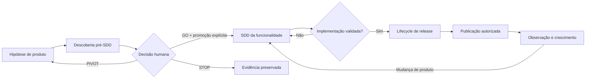
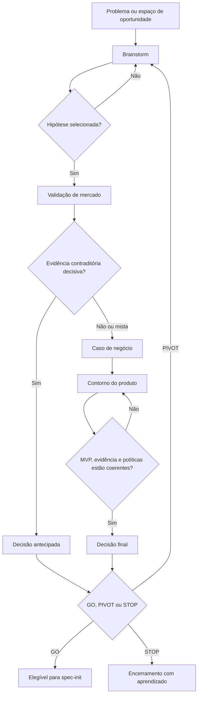
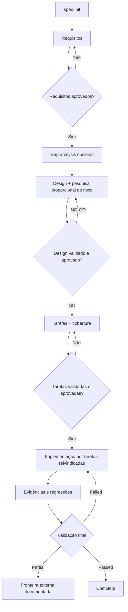
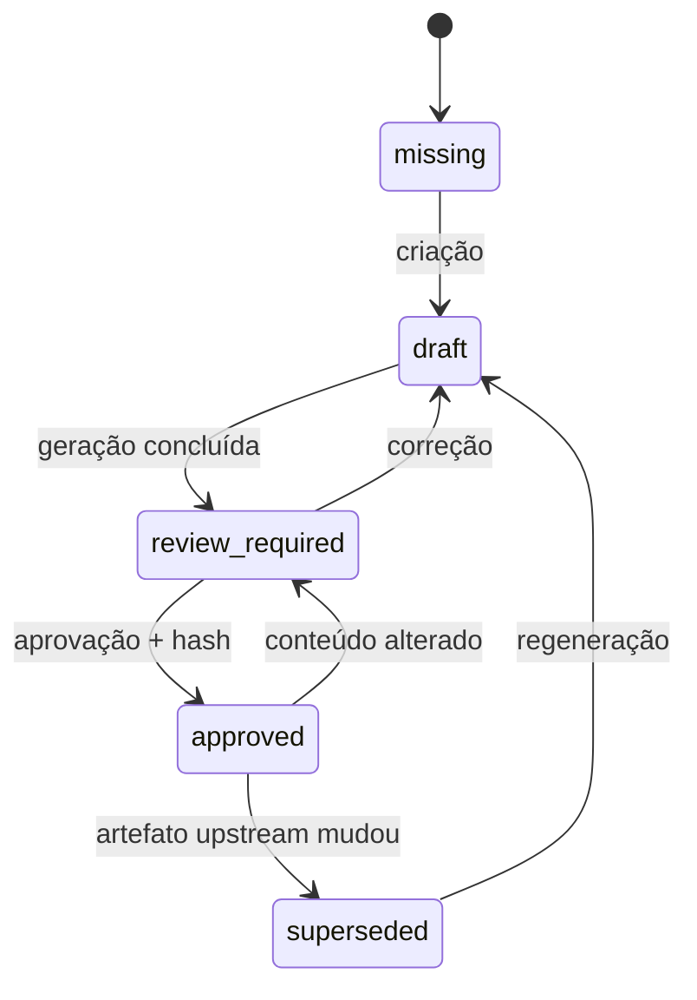
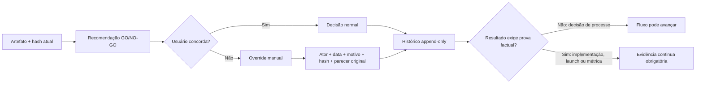
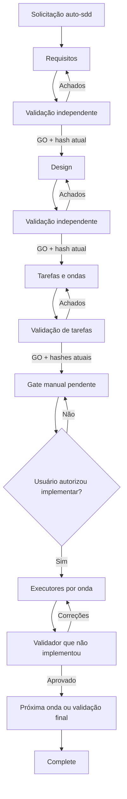
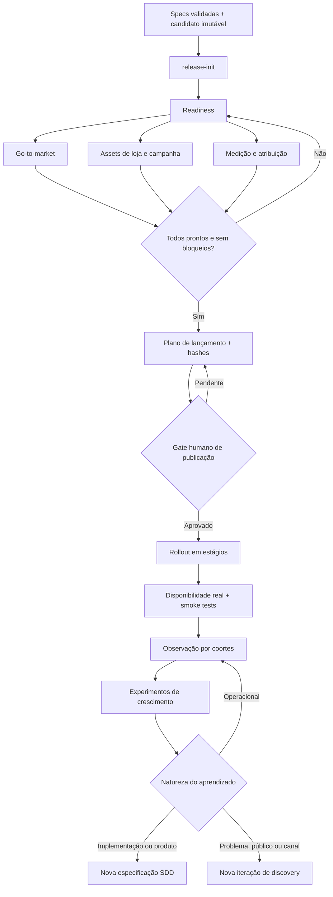

# Do fluxo artesanal ao framework verificável: desenvolvimento e evolução do Pixel Hop Framework

## Resumo

Este artigo apresenta um relato técnico sobre o desenvolvimento do Pixel Hop Framework, um framework de *Spec-Driven Development* (SDD) voltado à coordenação de agentes de inteligência artificial em projetos de software. O texto reconstrói a motivação inicial do trabalho, caracteriza uma primeira versão formativa (V1) e analisa a transição para a V2, lançada como uma arquitetura canônica, independente de agente e parcialmente verificável por máquina. A principal tese é que essa evolução não resultou apenas da necessidade de produzir documentação mais detalhada, mas de resolver problemas de governança: divergência entre ferramentas, estados ambíguos, aprovações obsoletas, perda de rastreabilidade, conflitos em execução paralela e ausência de evidências duráveis. Também são discutidas as extensões até a versão 2.10.0, que incorporaram descoberta de produto, preparação de lançamento, recuperação de automações, overrides humanos auditáveis, seleção de modelos orientada por custo e risco e governança explícita de contexto e tokens. A evolução mais recente foi orientada por uma investigação paralela sob quatro perspectivas — Product/UX Design, arquitetura de software, Growth e custos — que revelou uma distinção central: o usuário pode assumir conscientemente uma decisão de negócio ou processo, mas essa autoridade não pode fabricar evidência técnica, disponibilidade em produção ou desempenho de mercado.

**Palavras-chave:** desenvolvimento orientado por especificações; agentes de inteligência artificial; engenharia de software; rastreabilidade; automação; governança de workflows.

## 1. Introdução

O uso de agentes de inteligência artificial no desenvolvimento de software altera a velocidade de execução, mas não elimina os problemas clássicos da engenharia de software. Requisitos ainda podem ser ambíguos; decisões arquiteturais ainda podem perder seu contexto; tarefas ainda podem omitir comportamentos necessários; testes ainda podem ser insuficientes; e duas frentes de implementação ainda podem modificar os mesmos arquivos de forma incompatível. Em alguns casos, o aumento de velocidade torna essas fragilidades mais visíveis, porque uma interpretação incorreta pode ser propagada por várias etapas antes de receber revisão humana.

O Pixel Hop Framework surgiu nesse contexto. Seu objetivo foi criar um método reutilizável de SDD para projetos que combinam clientes móveis, serviços de backend, recursos de plataforma e atividades de medição de produto. Outro requisito central foi permitir que diferentes agentes — inicialmente Claude e Codex — trabalhassem de forma independente ou coordenada sem que cada ferramenta passasse a operar segundo uma versão própria do processo.

Este artigo descreve a evolução do framework como um estudo de engenharia de método. A análise se baseia nos artefatos do próprio repositório: histórico de commits, lifecycle canônico, workflows, regras, schemas, ferramentas de validação, instalador, README e changelog. Há uma limitação documental relevante: o repositório preserva como primeiro marco funcional o commit denominado “SDD V2”, de 14 de julho de 2026; a V1 não está arquivada nele como uma distribuição versionada. Por essa razão, a seção dedicada à V1 descreve uma fase formativa reconstruída a partir das lacunas que a V2 tornou explícitas. Essa distinção evita atribuir à primeira versão detalhes que não podem ser comprovados pelo registro disponível.

## 2. Motivação inicial: controlar a distância entre intenção e execução

A motivação inicial do Pixel Hop Framework pode ser sintetizada como a tentativa de reduzir a distância entre quatro elementos: a intenção do produto, a especificação do comportamento, a implementação produzida por agentes e a evidência de que o resultado corresponde ao que foi solicitado.

Prompts isolados são eficazes para tarefas locais, mas pouco adequados para manter essa continuidade ao longo de mudanças maiores. Uma conversa pode registrar uma decisão, porém não oferece, por si só, um estado confiável para a próxima sessão ou para outro agente. Da mesma forma, um documento de requisitos pode parecer completo sem que todos os seus itens tenham sido convertidos em tarefas, e uma lista de tarefas marcada como concluída pode não revelar quais testes foram executados ou quais verificações permaneceram dependentes de dispositivo, credencial ou serviço externo.

O problema era, portanto, menos “como fazer um agente escrever código” e mais “como preservar significado, autoridade e evidência durante todo o desenvolvimento”. A resposta inicial foi organizar o trabalho em torno de especificações: primeiro compreender o produto e seu contexto; depois registrar requisitos; em seguida produzir design e tarefas; somente então implementar e validar.

Esse encadeamento também atendia a uma necessidade de reutilização. Decisões específicas de um produto — nomes, identificadores, infraestrutura, comandos de build ou estado operacional — não deveriam contaminar o método compartilhado. O framework precisaria conter princípios e procedimentos reutilizáveis, enquanto cada projeto consumidor manteria seu próprio *steering*, configuração e histórico.

## 3. V1: a fase formativa

A V1 pode ser entendida como a etapa em que o SDD existia principalmente como prática operacional. Seu valor estava em impor uma sequência mais disciplinada ao trabalho do agente: explicitar requisitos antes do design, decompor o design em tarefas e validar a implementação ao final. Em comparação com uma interação puramente conversacional, isso já representava um avanço importante.

Contudo, um processo descrito sobretudo por comandos e instruções específicas de ferramenta tende a apresentar quatro limitações.

Primeiro, a semântica do processo pode ficar distribuída. Se um comando de Claude e uma skill de Codex descrevem diretamente as mesmas transições, qualquer alteração precisa ser replicada. Com o tempo, pequenas diferenças de linguagem podem se tornar diferenças de comportamento. A especificação do método passa a ser múltipla justamente quando deveria funcionar como referência comum.

Segundo, o estado pode permanecer implícito ou ser representado por indicadores genéricos. Expressões como “requisitos gerados”, “pronto para implementação” ou “concluído” são úteis para leitura humana, mas insuficientes quando não se sabe se o artefato foi apenas criado, revisado, aprovado, posteriormente modificado ou invalidado por uma alteração anterior.

Terceiro, instruções textuais são difíceis de verificar automaticamente. Um processo pode recomendar rastreabilidade, por exemplo, sem detectar que um requisito não aparece em nenhuma tarefa. Pode exigir aprovação sem perceber que o documento aprovado foi editado depois. Pode autorizar paralelismo sem impedir que dois agentes reivindiquem o mesmo escopo de escrita.

Quarto, o método pode permanecer acoplado ao projeto em que nasceu. A cópia manual de comandos, templates e regras aumenta o risco de transportar dados específicos, sobrescrever artefatos pertencentes ao projeto ou criar instalações diferentes entre equipes.

Essas limitações não tornam a V1 inútil. Pelo contrário, elas são típicas de uma fase em que um processo demonstra valor antes de se transformar em infraestrutura. A V1 estabeleceu a hipótese fundamental do framework: agentes trabalham melhor quando a implementação é precedida por artefatos explícitos e por decisões progressivas. A V2 nasceu da necessidade de tornar essa hipótese repetível, portável e auditável.

## 4. A transição para a V2

A V2 foi formalizada em 14 de julho de 2026 como a primeira distribuição funcional preservada no repositório. Ela não se limitou a ampliar o conjunto de prompts. A mudança central foi arquitetural: o workflow passou a ter uma fonte canônica e independente de agente, situada em `.sdd/settings/`, enquanto Claude e Codex passaram a operar por adaptadores finos.

Essa separação organizou o framework em cinco camadas complementares:

1. o lifecycle definiu estados e transições;
2. os workflows definiram a sequência operacional;
3. as regras e os templates definiram a qualidade esperada dos artefatos;
4. os schemas e as ferramentas verificaram invariantes;
5. os adaptadores traduziram o método para as capacidades de cada agente.

O resultado foi uma mudança de natureza. Na V1, o processo podia ser entendido como um conjunto de instruções para orientar agentes. Na V2, ele passou a funcionar como um pequeno sistema de governança do desenvolvimento.

## 5. Melhorias da V2 e as motivações correspondentes

### 5.1 Fonte canônica independente de agente

**Melhoria.** Os workflows foram centralizados em uma camada neutra, e os comandos de Claude e a skill de Codex tornaram-se adaptadores que apontam para essa fonte.

**Motivação.** A duplicação de regras entre ferramentas cria divergência silenciosa. Dois agentes podem receber comandos com o mesmo nome, mas executar transições ou critérios diferentes. A fonte única reduz esse risco e permite que uma alteração de lifecycle seja feita no núcleo, com testes de paridade para os adaptadores.

Essa escolha também ampliou a vida útil do framework. Um novo agente pode ser integrado por meio de outro adaptador sem exigir a reescrita da semântica central.

### 5.2 Lifecycle explícito para artefatos e execução

**Melhoria.** Requisitos, design e tarefas passaram a seguir estados como `missing`, `draft`, `review_required`, `approved` e `superseded`. Implementação e validação receberam estados próprios, e a fase superior passou a ser derivada desses estados.

**Motivação.** Um único marcador de fase não distingue situações operacionalmente diferentes. Um design pode existir sem estar aprovado; tarefas aprovadas podem ficar obsoletas após a revisão de um requisito; uma implementação pode estar concluída, mas depender de validação externa. O modelo explícito reduz a ambiguidade e impede que o fluxo avance apenas porque um arquivo existe.

A V2 também preservou campos legados como espelhos de compatibilidade. A motivação foi permitir adoção gradual, sem reescrever automaticamente o histórico dos projetos existentes.

### 5.3 Aprovações vinculadas ao conteúdo

**Melhoria.** Aprovações passaram a registrar o hash do conteúdo aprovado. Se o arquivo muda, a aprovação deixa de corresponder ao artefato atual e as aprovações dependentes podem ser marcadas como superadas.

**Motivação.** Aprovar apenas o nome ou a presença de um documento produz uma autorização frágil. Depois de uma edição, o sistema não consegue distinguir o texto aprovado do texto atual. O vínculo por hash transforma a aprovação em uma relação verificável entre uma decisão humana ou delegada e bytes específicos.

Essa melhoria é particularmente importante em fluxos com agentes, nos quais correções automáticas podem modificar um artefato após uma revisão inicial.

### 5.4 Requisitos testáveis e rastreabilidade até as tarefas

**Melhoria.** A V2 introduziu critérios em formato EARS, identificadores numéricos estáveis, mapeamento explícito entre tarefas e requisitos e um arquivo de cobertura para disposições como adiamento ou exclusão justificada.

**Motivação.** Requisitos narrativos podem ser claros para leitura, mas difíceis de localizar e verificar ao longo do processo. Identificadores estáveis permitem que design, tarefas, testes e validações façam referência ao mesmo comportamento. A verificação de cobertura impede que um requisito desapareça durante a decomposição do trabalho.

O arquivo de cobertura reconhece ainda que nem todo requisito ausente de uma entrega é um erro: ele pode ter sido adiado, condicionado ou retirado de escopo. A exigência de uma disposição e de uma justificativa transforma a omissão silenciosa em decisão explícita.

### 5.5 Evidência durável e limites de ambiente

**Melhoria.** Validações passaram a produzir registros persistentes em `evidence.jsonl` e um resumo em `validation.md`, distinguindo resultados aprovados, reprovados, parciais ou não executados.

**Motivação.** Marcar uma tarefa como concluída não demonstra que ela foi verificada. Além disso, projetos móveis e serviços integrados frequentemente dependem de simuladores, dispositivos, credenciais, consoles ou revisões externas. Declarar sucesso integral nessas condições seria impreciso.

O estado `partial` e o tipo de evidência de fronteira ambiental permitem registrar o que foi comprovado e o que permanece fora do alcance da execução atual. A confiabilidade deriva, nesse caso, não da pretensão de completude, mas da descrição precisa do limite.

### 5.6 Paralelismo com reivindicação de escopo

**Melhoria.** A V2 associou tarefas paralelizáveis a dependências, escopos de escrita e reivindicações atômicas. Escopos sobrepostos não podem permanecer ativos simultaneamente.

**Motivação.** A marcação de uma tarefa como paralela indica independência lógica, mas não impede conflitos físicos no repositório. Dois agentes podem trabalhar em funcionalidades diferentes e ainda editar o mesmo arquivo de configuração. A reivindicação de escopo funciona como um mecanismo de coordenação explícita; ela complementa, mas não substitui, o isolamento oferecido por branches ou worktrees.

### 5.7 Schemas, lint e verificação de distribuição

**Melhoria.** Estados de especificação, cobertura e evidência receberam schemas e verificações executáveis. O repositório também passou a testar a presença dos arquivos necessários e a correspondência entre workflows canônicos e adaptadores.

**Motivação.** Regras apenas documentadas dependem de interpretação e disciplina constantes. Parte delas, porém, pode ser expressa como invariante: um artefato aprovado deve ter hash; uma fase completa deve ter validação aprovada; um requisito não pode desaparecer sem disposição; um adaptador deve apontar para um workflow existente. Automatizar essas verificações reduz a quantidade de revisão humana gasta em inconsistências mecânicas.

Essa camada não substitui o julgamento de engenharia. Ela reserva esse julgamento para problemas que não podem ser decididos apenas por estrutura.

### 5.8 Instalador não destrutivo e separação de propriedade

**Melhoria.** O framework recebeu um instalador capaz de sincronizar arquivos gerenciados sem sobrescrever configuração, steering, especificações, status ou artefatos históricos pertencentes ao projeto consumidor.

**Motivação.** Um método reutilizável precisa de uma fronteira clara entre aquilo que o framework controla e aquilo que pertence ao produto. Sem essa fronteira, uma atualização pode apagar personalizações ou modificar evidências históricas. A instalação não destrutiva tornou a adoção e a atualização deliberadas, preservando dados locais.

### 5.9 Versionamento semântico e migração aditiva

**Melhoria.** A V2 estabeleceu regras de versionamento: correções compatíveis como *patches*, novas capacidades compatíveis como versões menores e mudanças incompatíveis de lifecycle ou schema como versões maiores. Migrações históricas devem ser aditivas.

**Motivação.** Um workflow também é uma dependência. Alterar sua semântica pode mudar o significado de estados já persistidos e de aprovações anteriores. O versionamento comunica o impacto esperado, enquanto a migração aditiva evita reescrever o passado para fazê-lo parecer produzido por uma versão mais recente.

## 6. Funcionamento detalhado do framework

### 6.1 Visão geral: três lifecycles conectados, mas independentes

O Pixel Hop Framework organiza o trabalho em três lifecycles. O primeiro, opcional, examina se uma oportunidade merece investimento. O segundo transforma uma necessidade selecionada em uma implementação validada. O terceiro prepara essa implementação para distribuição e aprendizado no mercado. Embora exista uma progressão natural entre eles, os artefatos permanecem separados: uma descoberta não se torna requisito aprovado automaticamente, e uma especificação validada não recebe estado de marketing ou lançamento.

Essa separação evita um erro comum em processos contínuos: usar a aprovação obtida em uma fase como autorização implícita para todas as fases posteriores. No framework, uma decisão `GO` apenas torna a descoberta elegível para promoção; requisitos ainda precisam ser produzidos. Do mesmo modo, a conclusão de uma especificação não autoriza publicação, alteração de preço, comunicação pública ou investimento em mídia.

Todos os workflows compartilham um contrato comum. Antes de agir, o agente carrega a configuração, o lifecycle e somente o contexto necessário; inspeciona o código vivo antes de confiar em resumos; preserva histórico e hashes; escolhe uma estratégia de verificação proporcional à tarefa; registra evidência; respeita escopos de escrita; e executa lint antes de encerrar uma mutação. A partir da 2.10.0, um manifesto de contexto registra quais entradas foram carregadas e seus hashes, permitindo reutilização *delta-first*: conteúdo estável não precisa ser relido ou revalidado integralmente quando apenas uma parte do contrato mudou. O contrato comum reduz diferenças entre comandos, custo de contexto e o risco de cada etapa estabelecer suas próprias regras básicas.

### 6.2 Steering: formar uma memória durável do projeto

O fluxo pode começar por `steering`, embora essa etapa não pertença ao lifecycle de uma funcionalidade. Sua finalidade é construir a memória estável que orientará todas as especificações posteriores. O agente examina código e configuração reais para registrar produto, arquitetura, segurança, testes, implantação e relações entre repositórios.

O critério de seleção é a durabilidade. Convenções arquiteturais, fronteiras de responsabilidade e restrições de segurança pertencem ao steering; contagens de arquivos, progresso temporário, estado de rollout ou detalhes de uma tarefa ativa não pertencem. Informações voláteis envelhecem rapidamente e, se forem tratadas como orientação permanente, passam a induzir novos agentes ao erro.

O workflow `steering-custom` permite adicionar contextos especializados, como autenticação, banco de dados, deployment ou padrões de API. Cada documento é registrado em um perfil de contexto. Assim, uma especificação de interface não precisa carregar detalhes de infraestrutura que não afetam sua decisão, enquanto uma mudança de autenticação recebe o conjunto completo de restrições relevantes. A saída dessa etapa não é código, mas uma base decisória curta, verificável e reutilizável.

### 6.3 Descoberta pré-SDD: decidir antes de especificar

O lifecycle de descoberta foi concebido para responder a uma pergunta anterior à engenharia: vale a pena consumir capacidade de implementação nesta hipótese? O fluxo completo é apresentado a seguir.

#### 6.3.1 Brainstorm

O brainstorm recebe um espaço de problema opcional e começa pelo levantamento das restrições reais: tempo disponível, orçamento, plataformas, capacidades técnicas, dependências operacionais e limites de risco. Antes de ordenar soluções, explicita jornada atual, trabalho ou resultado desejado, frequência e severidade da dor, alternativas utilizadas e forças que favorecem ou impedem a mudança. A interação ocorre com uma pergunta focal por vez para evitar que premissas não confirmadas sejam incorporadas silenciosamente.

Depois que o envelope operacional está suficientemente claro, o workflow registra hipóteses candidatas, elimina aquelas que violam restrições duras e compara as restantes por viabilidade. Para produtos móveis, a fase usa apenas uma triagem preliminar `green`, `yellow`, `red` ou `unknown` para Apple e Google. A avaliação quantitativa completa é adiada até que plataforma e conceito estejam definidos, reduzindo falsa precisão, repetição e otimização prematura para a revisão da loja.

A etapa somente termina quando o usuário seleciona explicitamente uma hipótese. Essa exigência preserva uma divisão de responsabilidade: o agente amplia e organiza alternativas; a escolha do problema que merece pesquisa continua humana.

#### 6.3.2 Validação de mercado

A validação começa declarando a hipótese e seus critérios de falseamento. Em seguida, pesquisa demanda, concorrentes, substitutos, preços, reclamações, canais de distribuição e evidências contrárias. A modalidade de evidência é declarada como `desk_only`, `primary` ou `mixed`, para que pesquisa documental não seja confundida com contato direto com usuários. Entrevistas, observação, testes, surveys, analytics internos e tickets podem ser registrados junto a fontes web em um *evidence ledger* append-only, com proveniência, método, confiança, limitações, direção da evidência e referência anonimizada quando aplicável.

O resultado pode ser `supports`, `mixed` ou `contradicts`. “Não encontrar concorrentes” não é tratado como prova de oportunidade, pois também pode indicar ausência de demanda ou dificuldade de distribuição. Um resultado baseado apenas em desk research carrega confiança limitada e deve declarar a validação posterior necessária. Quando a evidência contradiz a hipótese, o fluxo recomenda decidir por pivot ou stop; o caso de negócio somente continua se o usuário quiser quantificar uma versão materialmente revisada ou uma exceção documentada.

Para aplicativos, a etapa também revisa políticas atuais das lojas. Apple e Google recebem avaliações separadas, porque suas regras não são intercambiáveis. No caso da Apple, procedência ou duplicação de submissões é separada de substituibilidade de mercado; o framework compara o núcleo do produto com os concorrentes mais próximos, pergunta quando a diferença se torna visível e preserva o argumento adversarial mais forte para uma eventual rejeição.

#### 6.3.3 Caso de negócio

O caso de negócio transforma uma hipótese apoiada ou ainda plausível em um modelo econômico explícito. Ele identifica pagador, valor entregue, fronteira do paywall, custos fixos e variáveis, premissas editáveis e cenários de baixa, base e alta. Também calcula sensibilidade de break-even, necessidade de caixa, retorno e custo de oportunidade em relação a produtos ou atividades já existentes.

Valores particulares do desenvolvedor não são inventados. Se orçamento, conversão, churn ou custo de aquisição não forem conhecidos, o workflow solicita o dado material ou o representa como intervalo. Preços de terceiros, taxas e políticas mutáveis são pesquisados novamente. O veredito — `viable`, `conditional` ou `unviable` — é acompanhado das condições que o sustentam. Em um caso condicional, cada limiar deve possuir o teste mais barato capaz de reduzi-lo.

#### 6.3.4 Contorno do produto

O contorno do produto traduz oportunidade e economia em um MVP estreito. Ele define trabalho principal do usuário, proposta de valor, core loop, fluxos de alto nível, fatias de release, não objetivos, obrigações operacionais, fronteiras de confiança, medições e limites de abandono. Hipóteses de desejabilidade, viabilidade, factibilidade, usabilidade, distribuição e compliance são consolidadas em um ledger transversal, com impacto, incerteza, teste, limiar, estado e validade temporal.

A etapa tem função de contenção. O único perfil de product discovery permanece `single-mobile-indie`: um desenvolvedor independente, mobile e de baixo orçamento. O framework favorece um núcleo sem entrega humana por transação e, quando necessário, uma única plataforma inicial. As profundidades mínima, leve ou completa usadas na descoberta técnica do design representam intensidade de pesquisa, não novos perfis de produto. A avaliação de loja é recalculada com base nos fluxos concretos; uma diferença alegada que não aparece no primeiro valor entregue ao usuário não recebe o mesmo peso de uma diferenciação demonstrável.

O contorno fica `ready` apenas quando escopo, capacidade, política e mensuração são coerentes e quando a principal hipótese de conceito ou usabilidade recebeu validação proporcional ao risco. Um fluxo conhecido e reversível pode exigir apenas walkthrough ou teste de compreensão; uma interação nova pede protótipo executável por tarefas; domínios de confiança, IA, finanças, saúde ou permissões exigem ainda avaliação de linguagem, expectativa, erro e explicabilidade. Caso contrário, permanece em `rework_required`, sem avançar por conveniência.

#### 6.3.5 Decisão

A decisão audita a consistência entre usuário, problema, evidência de mercado, premissas econômicas, MVP, custos e restrições. O agente apresenta recomendação, evidência decisiva, incertezas e o próximo experimento de menor custo; o usuário escolhe `GO`, `PIVOT` ou `STOP`. A promoção para SDD usa um brief estruturado, que transporta problema, público, proposta, escopo, não objetivos, hipóteses ainda abertas, métricas, riscos e proveniência sem converter automaticamente conclusões de discovery em requisitos aprovados.

Um `PIVOT` incrementa a iteração, preserva o histórico e retorna à primeira fase invalidada. Um `STOP` é considerado um resultado bem-sucedido da descoberta: evita investimento e mantém a evidência para que a mesma hipótese não seja reaberta sem informação nova. Um `GO` torna a descoberta elegível para promoção, mas a criação da especificação requer novo pedido explícito. Quando o usuário discorda de uma recomendação de gate, pode registrar um override manual com decisão, identidade, data, justificativa e hash do conteúdo avaliado. O histórico preserva simultaneamente a recomendação do framework e a decisão humana assumida.

### 6.4 SDD principal: da intenção ao software validado

O lifecycle central é uma sequência de elaboração e redução de incerteza. Cada fase produz um artefato com função própria, e cada gate impede que decisões posteriores sejam construídas sobre uma base ainda instável.

#### 6.4.1 Inicialização da especificação

`spec-init` cria o menor envelope possível: `spec.json` e um esqueleto de `requirements.md`. O nome da funcionalidade é normalizado, os perfis de contexto relevantes são registrados e o lifecycle começa em requisitos/draft.

A restrição de não gerar design e tarefas neste momento é deliberada. Produzir todos os documentos em uma única passagem cria uma aparência de progresso, mas faz com que decisões arquiteturais sejam derivadas de requisitos ainda não revisados. Quando a especificação nasce de uma descoberta, apenas a proveniência é registrada; o texto da descoberta permanece contexto não aprovado.

#### 6.4.2 Requisitos

`spec-requirements` define o que o produto deve fazer, não como o código será organizado. Os comportamentos usam critérios numerados `N.M` e formato EARS, favorecendo condições, eventos, respostas esperadas e estados indesejados observáveis.

Além do caminho funcional principal, o workflow considera falhas, privacidade, segurança, observabilidade, acessibilidade, localização e restrições não funcionais mensuráveis quando aplicáveis. Classes, frameworks e caminhos de arquivo ficam fora do documento, salvo quando constituem uma restrição real do produto.

Ao final, o artefato entra em `review_required`. A validação de requisitos procura ambiguidades, lacunas, IDs inválidos e critérios não testáveis. No modo convencional, o usuário aprova o conteúdo; no `auto-sdd`, a aprovação delegada somente ocorre após um ciclo independente de GO, correção e nova validação sobre os bytes finais.

#### 6.4.3 Análise de lacunas

`validate-gap` é opcional, mas especialmente útil em projetos brownfield. Ele compara requisitos aprovados com código, testes, schemas, APIs e configuração existentes. O documento resultante identifica capacidades reutilizáveis, lacunas, restrições, alternativas, esforço e risco.

Essa etapa não altera aprovações nem avança o lifecycle. Sua função é informar o design, evitando tanto a reinvenção de componentes já disponíveis quanto a suposição de que uma implementação parcial satisfaz o novo contrato. Para impedir que a análise se torne um handoff órfão, o design registra se ela foi consumida e o hash da versão utilizada.

#### 6.4.4 Design e descoberta técnica

`spec-design` classifica a necessidade de pesquisa como mínima, leve ou completa. Padrões locais conhecidos e sem dependências relevantes admitem investigação mínima; novas arquiteturas, integrações externas, segurança, privacidade ou impacto multiplataforma elevam a profundidade.

A pesquisa é persistida em `research.md`, com fontes, alternativas, decisões, riscos e dúvidas abertas. O `design.md` resultante funciona como contrato de implementação: descreve fronteiras, fluxos, interfaces, dados, migração, observabilidade, rollout, testes e rastreabilidade até os requisitos.

`validate-design` revisa integração com a arquitetura existente, propriedade de dados, contratos, segurança, comportamento entre plataformas e estratégia de verificação. O parecer prioriza até três bloqueios para uma decisão clara de GO/NO-GO. Um GO técnico não equivale automaticamente à aprovação do artefato no fluxo convencional; a aprovação continua vinculada ao hash do conteúdo. O usuário pode passar manualmente o gate, mas o override registra ator, instante, justificativa, recomendação substituída e hash. Uma revisão posterior do design torna essa decisão obsoleta de forma determinística.

#### 6.4.5 Planejamento das tarefas

`spec-tasks` converte o contrato de design em unidades executáveis com no máximo dois níveis de hierarquia. Cada tarefa acionável declara requisitos atendidos, dependências, áreas afetadas, escopo de escrita, estratégia de verificação e evidência esperada. Desde a 2.10.0, `tasks.json` é o ledger canônico estruturado, enquanto `tasks.md` funciona como visão legível; essa separação reduz a duplicidade entre plano narrativo e estado operacional.

Todos os critérios de aceitação devem aparecer em uma tarefa ou em `coverage.json` com uma disposição explícita e justificativa. O marcador `(P)` somente é usado quando dependências e escopos demonstram concorrência segura; o parser canônico reconhece o sufixo oficial e não infere paralelismo apenas da aparência do texto. Na revisão, `validate-tasks` audita cobertura, ordem do grafo, sobreposição, verificações, integrações e fronteiras externas. O objetivo é descobrir falhas no plano antes que elas se convertam em alterações concorrentes no código.

#### 6.4.6 Implementação

`spec-impl` exige tarefas aprovadas e IDs explícitos. Antes de editar, o executor reivindica a tarefa, registrando proprietário, commit-base e escopo de escrita. Uma tarefa marcada como paralela não dispensa essa reivindicação. Claims convencionais validam o contrato da tarefa e locks órfãos possuem recuperação segura, de modo que falhas de processo não deixem o plano permanentemente bloqueado nem liberem trabalho sem proveniência.

O executor carrega somente requisitos mapeados, contratos de design pertinentes e steering necessário. A verificação é escolhida conforme o trabalho: teste primeiro para comportamento executável, teste de contrato para APIs e eventos, build ou lint para configuração, dry-run para migrações e evidência manual apenas quando a automação não é viável.

O ciclo interno é implementar, refatorar, executar validação focal e então regressões relevantes. A evidência deve ser anexada antes de marcar a tarefa como concluída. Se uma dependência externa impedir a prova completa, o limite é registrado; se o trabalho for abandonado, a reivindicação é liberada explicitamente, sem fabricar evidência.

#### 6.4.7 Validação da implementação

`validate-impl` não confia apenas nos checkboxes das tarefas. Ele verifica cobertura e disposições, alinhamento com o design, evidências declaradas, testes focais, regressões e integrações abrangidas pelo escopo. O alvo vem de argumentos ou estado persistido, nunca apenas da memória da conversa.

O resultado é `passed`, `failed` ou `partial`. Somente evidência atual com resultado `passed` move a implementação para `validated`; checkboxes, overrides de processo ou evidência inadequada não produzem conclusão. Somente quando tarefas e cobertura estão encerradas a fase superior, derivada pelo tooling, se torna `complete`. `Partial` é uma descrição válida quando ainda há dispositivo, credencial, console, revisão externa ou ambiente indisponível, mas não é rebatizado como sucesso integral.

#### 6.4.8 Estado, invalidação e encerramento

Os artefatos seguem uma máquina de estados própria. A edição de conteúdo aprovado invalida seu hash e pode superar aprovações posteriores. Essa propagação impede que tarefas continuem aprovadas depois de uma mudança material nos requisitos.

`spec-status` deriva o estado efetivo de metadados, hashes, tarefas, evidências e reivindicações ativas. Ele expõe também divergências de proveniência, claims órfãos e overrides aplicáveis, sem alterar o projeto. Já `spec-close` oferece um terminal administrativo para trabalho obsoleto, substituído, cancelado, duplicado ou desnecessário. O encerramento preserva todos os bytes históricos, não executa validação e não afirma que trabalho pendente foi concluído. Reivindicações ativas precisam ser resolvidas antes do fechamento.

#### 6.4.9 Overrides humanos e o limite da autoridade

A investigação mostrou que um gate estritamente mecânico pode bloquear uma decisão legítima quando o usuário aceita conscientemente um risco que o framework recomenda evitar. A 2.10.0 passou, por isso, a permitir overrides de GO/NO-GO em discovery, revisão de artefatos e planejamento de release. O mecanismo não apaga nem reescreve o parecer original.

Essa fronteira evita dois extremos. O framework não substitui o dono do produto em decisões de risco; ao mesmo tempo, uma declaração humana não transforma testes falhos em `passed`, um upload em disponibilidade real ou uma hipótese de crescimento em resultado observado. A validade do override permanece vinculada ao conteúdo e ao escopo aprovados; qualquer alteração material exige nova decisão.

### 6.5 Auto-SDD: automação com uma fronteira manual

O `auto-sdd` automatiza o pipeline pré-implementação sem criar um lifecycle alternativo. A primeira invocação autoriza gerar, revisar, corrigir e aprovar requisitos, design e tarefas. Cada aprovação, contudo, depende de uma validação atual e do hash final do artefato.

Antes de qualquer alteração de código, o coordenador produz um plano de ondas, classifica capacidades de executores e validadores, seleciona o perfil de validação `lean`, `standard` ou `critical` e vincula esses dados aos hashes da especificação. Nesse ponto, o fluxo obrigatoriamente para.

Somente uma nova instrução explícita, nomeando a funcionalidade e autorizando a implementação, aprova o gate. A autorização anterior para planejar, um `GO` de discovery ou contexto conversacional não substituem essa decisão.

Na execução, ondas respeitam dependências e escopos. Subagentes executores modificam o código; validadores independentes revisam a onda; apenas o coordenador atualiza ledgers compartilhados. Cada subagente recebe um modelo explicitamente selecionado como o de menor custo capaz de satisfazer o nível requerido. A capacidade do validador final é derivada do perfil de validação selecionado, em vez de ser promovida implicitamente ao nível mais caro. O perfil `lean` permite reutilizar uma revisão independente completa em uma única onda; `standard` admite validação incremental e agrupamento de ondas independentes; `critical` conserva revisão por onda e validação final nova e completa. Em todos os casos, independência pós-código permanece obrigatória.

Loops de correção são limitados e observáveis. Orçamentos de tokens e custo, consumo por fase, reutilização por hash e razões de escalonamento ficam persistidos, permitindo interromper repetição improdutiva e decidir conscientemente entre compactar contexto, elevar capacidade ou solicitar intervenção humana. A recuperação introduzida na 2.9.0 preserva diffs, abandona apenas claims órfãos e exige reverificação na tentativa atual.

### 6.6 Release: do candidato validado ao aprendizado

O lifecycle de release começa com especificações validadas e um candidato identificável. Ele não altera os artefatos SDD; cria um domínio próprio para readiness, marketing, assets, medição, lançamento, observação e crescimento.

`release-init` fixa escopo, specs de origem, candidato, plataformas, mercados, locales, capacidade e orçamento confirmado. Candidato e escopo são representados de forma estruturada e recebem digests próprios, impedindo que uma aprovação de lançamento seja reutilizada para outro build, conjunto de funcionalidades ou mercado. A checklist é adaptada ao projeto vivo. Specs incompletas ou evidências equivalentes ausentes mantêm readiness bloqueada.

`release-readiness` examina qualidade do produto, operações, integrações, comércio, privacidade, suporte e rollback. Cada item recebe classificação, proprietário e evidência. Trabalho dependente de console, dispositivo ou revisão externa é fronteira, não resultado aprovado.

`release-marketing` define posicionamento, audiência, canais, orçamento, hipóteses mensuráveis e critérios de escala ou interrupção. Pesquisa mutável é atualizada e persistida. O workflow planeja, mas não publica conteúdo, contata terceiros ou gasta recursos. Um plano sem mídia paga é plenamente válido. Quando existe mídia paga, o gate próprio registra canal, conta, moeda, teto, datas, objetivo, audiência, guardrails e regras de parada.

`release-assets` produz a matriz de metadata, narrativa de screenshots, cópias localizadas e criativos, reunidos em um registro de assets e suas proveniências. As capturas devem vir do candidato real, em estado determinístico e seguro para privacidade. Arte gerada pode decorar, mas não inventar interface, resultado ou funcionalidade. Dimensões, legibilidade, localização, claims e URLs são verificados antes de declarar readiness.

`release-measurement` define árvore de métricas, funil, eventos, taxonomia de campanhas, atribuição, consentimento, reconciliação, baselines, guardrails e cadência. Uma captura de dashboard não basta: o fluxo crítico precisa demonstrar semântica, deduplicação e acesso às fontes de decisão.

`release-launch` reúne esses artefatos e apresenta GO/HOLD com candidato, rollout, bloqueios e hashes. O gate humano fica pendente até aprovação explícita da release nomeada. Qualquer mudança material revoga a autorização. Mídia paga possui gate separado com canal, moeda, teto, datas e regras de parada. “Launched” significa disponibilidade real no storefront ou track declarado, acompanhada de smoke tests de produção; upload e aprovação da loja ainda não satisfazem esse estado.

`release-monitor` registra snapshots estruturados por janela e coorte, preservando fontes, fuso, latência, contagens, taxas, custos, receita, confiabilidade e incerteza. O resultado pode ser `stable`, `alert` ou `insufficient_data`. Antes de interpretar variação, o workflow verifica eventos atrasados, duplicados ou quebrados.

Por fim, `release-growth` diagnostica o estágio restritivo do funil e formula experimentos estruturados com uma variável principal, métrica, guardrails, amostra, custo e regras de decisão. Além de aquisição, ativação, retenção e receita, o fluxo torna explícitos referral e reativação. Perdas e resultados inconclusivos são preservados, e `growth.complete` depende do encerramento ou disposição de todos os experimentos aplicáveis. Aprendizados são roteados conforme sua natureza: alterações de produto retornam ao SDD; invalidações de problema, público ou canal retornam à discovery; aprendizado operacional permanece no release. Gasto, preço, comunicação e experimentos em produção continuam dependentes de autorização explícita.

## 7. A V2 como plataforma evolutiva

Depois da versão 2.0.0, o framework evoluiu por extensões compatíveis. Essas mudanças ajudam a compreender problemas que não estavam no núcleo inicial, mas surgiram quando o método passou a cobrir o ciclo de vida mais amplo de um produto.

A versão 2.1.0 introduziu uma etapa de descoberta anterior ao SDD. A motivação foi econômica: especificar e implementar corretamente uma ideia pouco promissora continua sendo desperdício. O novo lifecycle passou a avaliar hipótese, mercado, viabilidade, escopo de produto e uma decisão explícita de `GO`, `PIVOT` ou `STOP`, mantendo pesquisa atual e fontes persistentes.

A versão 2.2.0 adicionou o `auto-sdd`. O problema tratado foi o custo de interação gerado por aprovações repetidas durante requisitos, design e tarefas. A solução permitiu delegar essas aprovações após validações e correções, mas preservou uma barreira manual única antes da implementação. Essa fronteira expressa um princípio relevante: automação de planejamento não equivale a autoridade para modificar código ou sistemas externos.

A versão 2.3.0 ampliou o método para o período posterior à implementação. A motivação foi reconhecer que software validado não é sinônimo de produto pronto para publicação. Readiness operacional, materiais de loja, marketing, medição, rollout e crescimento receberam lifecycle próprio, evidências append-only e barreiras separadas para publicação e mídia paga.

As versões 2.4.0 e 2.4.1 incorporaram avaliação de prontidão para políticas de loja, com tratamento separado para Apple e Google e maior precisão na análise das regras antispam da Apple. A motivação foi antecipar riscos de rejeição e evitar que uma média de pontuação escondesse um bloqueio crítico. Política de distribuição passou, assim, a ser tratada como restrição de design, não como verificação tardia.

A versão 2.5.0 introduziu seleção explícita de modelos por capacidade, custo e risco. A motivação foi impedir duas formas opostas de desperdício: usar modelos de maior custo em tarefas rotineiras ou usar modelos insuficientes em trabalho crítico. A seleção concreta e persistida também evitou que a herança implícita do modelo do coordenador ocultasse qual capacidade realmente executou ou validou uma tarefa.

A versão 2.6.0 acrescentou `spec-close`, um caminho terminal para especificações obsoletas, substituídas, canceladas, duplicadas ou desnecessárias. A motivação foi distinguir encerramento administrativo de conclusão técnica. Forçar uma especificação abandonada pelo pipeline de validação produziria trabalho sem valor e poderia falsificar seu estado histórico.

A versão 2.7.0 tornou a validação adaptativa, com perfis `lean`, `standard` e `critical`. A motivação foi reduzir revisões redundantes sem abandonar independência. Reutilização vinculada a hash, validação incremental e agrupamento de ondas independentes permitem ajustar custo e profundidade ao risco persistido da entrega.

A versão 2.8.0 estendeu a instalação não destrutiva para os arquivos de orientação dos agentes. Blocos gerenciados e delimitados em `AGENTS.md` e `CLAUDE.md` passaram a poder ser atualizados sem sobrescrever instruções pertencentes ao projeto consumidor. Marcadores ambíguos ou malformados falham antes de qualquer mutação.

A versão 2.9.0 acrescentou retomada e recuperação determinísticas ao `auto-sdd`. A motivação foi tratar interrupções como parte normal de uma orquestração longa. A recuperação preserva alterações existentes, abandona apenas claims comprovadamente órfãos, incrementa tentativas, reinicializa validadores obsoletos e exige evidência produzida na tentativa atual.

A versão 2.10.0 foi orientada por uma investigação transversal do fluxo. No pré-SDD, adicionou problem framing, modalidades de evidência, ledger de hipóteses, validação de conceito e usabilidade proporcional e promoção estruturada, mantendo `single-mobile-indie` como o único perfil de product discovery. No SDD, corrigiu divergências entre contrato e tooling, tornou tarefas e fases efetivamente deriváveis e reforçou invalidação, claims, evidências e recuperação. No pós-SDD, vinculou gate, candidato e escopo, estruturou métricas e experimentos e fechou o retorno do aprendizado para SDD ou discovery. Em governança, introduziu manifestos de contexto, trabalho *delta-first*, limites de correção, telemetria e budgets de tokens. A mesma versão formalizou overrides humanos auditáveis para gates de decisão, sem permitir que eles substituam evidência factual.

Em conjunto, essas extensões mostram uma trajetória coerente. A V2 começou organizando o desenvolvimento de uma especificação; a série 2.x passou a governar também a decisão de investir, a autorização para implementar, a preparação para publicar e o aprendizado posterior ao lançamento.

## 8. Insights da investigação sob quatro perspectivas

A investigação que precedeu a 2.10.0 não executou as rules nem os workflows de SDD como método de análise. Ela realizou leitura estática do lifecycle, workflows, templates, schemas, ferramentas e adaptadores, com frentes paralelas de Product/UX Design, arquitetura de software e Growth, seguidas de uma consolidação de custos. Esse método foi deliberado: o objetivo era avaliar o processo como sistema, sem deixar que o próprio processo condicionasse o diagnóstico.

| Perspectiva | Diagnóstico | Resposta incorporada |
| --- | --- | --- |
| Product/UX Design | o pré-SDD filtrava bem investimento, viabilidade e risco de loja, mas podia recomendar `GO` sem evidência direta de usuário ou teste de conceito | problem framing, modos `desk_only`/`primary`/`mixed`, evidence e assumption ledgers, validação proporcional e promotion brief |
| Arquitetura de software | os contratos documentais eram fortes, porém parser, claims, conclusão, invalidação, estados e paridade nem sempre eram integralmente garantidos pelo tooling | parser `(P)` corrigido, claims reforçados, conclusão por evidência `passed`, revisão determinística, fase derivada, `tasks.json` canônico e recuperação de locks |
| Growth | o pós-SDD cobria readiness, GTM e measurement, mas candidato, escopo, snapshots e experimentos não tinham vínculo estrutural suficiente | digests de candidato/escopo, autorização de mídia completa, schemas de métricas e experimentos, referral, reativação e roteamento do aprendizado |
| Custos | seleção do menor modelo adequado e validação adaptativa já reduziam desperdício, mas faltavam budget, telemetria e leitura incremental | manifestos de contexto, reutilização por hash, validação *delta-first*, freshness de pesquisa, limites de correção e orçamento observável |

### 8.1 Discovery: evidência antes de precisão

O principal insight de design foi que coerência documental não é evidência de desejabilidade. Concorrentes, volume de busca e políticas de loja ajudam a dimensionar um mercado, mas não demonstram que um recorte de usuário percebe o problema com frequência e intensidade suficientes para mudar de comportamento. Por isso, a profundidade da validação passou a acompanhar o risco da hipótese, não o tamanho do template.

Outra conclusão foi preservar o foco. Criar perfis adicionais de product discovery aumentaria combinações, branches e custo de manutenção antes de existir demanda real por eles. O perfil `single-mobile-indie` continua sendo a restrição produtiva do método; as variações pertencem à modalidade de evidência e à intensidade do teste, não à identidade do perfil.

### 8.2 SDD: o contrato só existe quando o tooling o garante

A investigação arquitetural revelou que a presença de uma regra no workflow não garante seu enforcement. Um sufixo oficial não reconhecido pelo parser, um estado top-level escrito em vez de derivado ou uma tarefa concluída sem evidência adequada são defeitos de compatibilidade do processo, não detalhes de implementação.

Isso levou a uma regra de evolução mais estrita: lifecycle, workflow, template, schema, lint, ferramenta e adaptadores devem descrever a mesma semântica. A rastreabilidade também foi simplificada, com JSON estruturado como fonte operacional e Markdown como projeção humana. O ganho esperado não é apenas correção, mas menor volume de contexto duplicado em cada execução.

### 8.3 Growth: fechar o ciclo, não apenas lançar

O pós-SDD já distinguia software validado de produto lançado, mas a investigação mostrou que a autoridade de publicação precisava estar vinculada ao candidato exato. A mesma lógica vale para mídia: “há orçamento aprovado” é insuficiente sem canal, moeda, teto, período, objetivo e regras de parada.

Métricas e experimentos estruturados permitem que o aprendizado seja comparável entre janelas e iterações. O insight mais importante, porém, foi de roteamento: um resultado que invalida implementação volta ao SDD; um resultado que invalida problema, público ou canal volta à discovery; um ajuste de operação permanece no release. Sem essa distinção, growth acumula observações, mas não altera sistematicamente as decisões que as originaram.

### 8.4 Custos: otimizar repetição, não julgamento

A governança de tokens foi desenhada para retirar recomputação antes de retirar qualidade. O framework preserva validação independente, gates e evidência, mas reduz releitura de conteúdo estável, revisões integrais quando apenas um delta mudou, pesquisa ainda fresca e loops de correção sem informação nova.

As principais alavancas são:

1. carregar contexto por manifesto e hash;
2. validar primeiro o delta e ampliar somente quando risco ou impacto exigirem;
3. ler ledgers append-only a partir do último cursor processado;
4. reutilizar pesquisa dentro de sua janela explícita de validade;
5. limitar tentativas e registrar a razão de escalonamento;
6. selecionar a menor capacidade adequada, inclusive para o validador final;
7. medir tokens, custo estimado, cache/reuso e custo por artefato, onda e gate.

Budget não é autorização para reduzir silenciosamente a cobertura. Ao atingir um limite, o fluxo deve compactar, reaproveitar, replanejar ou pedir decisão; nunca declarar conclusão por economia.

### 8.5 Hipóteses que ainda precisam de medição

As mudanças reduzem riscos identificados, mas seus benefícios econômicos e de produto continuam sendo hipóteses. As métricas recomendadas incluem:

- proporção de decisões de discovery apoiadas por evidência primária ou mista;
- tempo e retrabalho entre promoção e requisitos aprovados;
- taxa de divergência entre schema, lint e lifecycle;
- invalidações detectadas antes da implementação;
- custo de tokens por artefato aprovado e por requisito validado;
- percentual de contexto reaproveitado por hash;
- taxa e justificativa de overrides;
- experimentos de Growth roteados para operação, SDD ou discovery;
- custo por aprendizado acionável, não apenas por execução de agente.

## 9. Discussão

O caso do Pixel Hop Framework evidencia três transformações.

A primeira é a passagem de instruções para contratos. Um prompt recomenda comportamento; um contrato define estados, pré-condições, saídas e evidências. A recomendação continua necessária para atividades criativas, mas o contrato reduz a liberdade justamente onde uma interpretação divergente causaria inconsistência.

A segunda é a passagem de uma automação centrada em produtividade para uma automação centrada em autoridade. O framework não pergunta apenas se um agente consegue executar uma ação, mas se possui autorização válida para fazê-lo. Aprovações vinculadas a hash, barreiras de implementação, gates de publicação e limites de orçamento tornam a autoridade parte do estado persistido.

A terceira é a passagem de validação uniforme para validação proporcional ao risco. No início, adicionar mais verificações parece sempre aumentar a qualidade. Em escala, porém, verificações repetitivas também consomem tempo e modelos mais caros sem necessariamente produzir informação nova. Os perfis adaptativos representam uma maturidade posterior: preservar independência e cobertura, mas evitar trabalho redundante quando artefato, contexto e hashes permanecem inalterados.

Há também um limite importante. O framework consegue verificar estrutura, rastreabilidade e certas transições, mas não pode determinar mecanicamente se uma necessidade de usuário foi compreendida em profundidade ou se uma arquitetura é a melhor possível. Seu papel é reduzir erros evitáveis, registrar decisões e criar pontos claros para julgamento humano e revisão independente. Os overrides da 2.10.0 tornam esse limite explícito: a máquina recomenda e preserva invariantes; o usuário pode assumir uma decisão, desde que não reescreva evidência.

## 10. Conclusão

O desenvolvimento do Pixel Hop Framework pode ser lido como a transformação de uma prática útil em uma infraestrutura de processo. A V1 formativa estabeleceu a disciplina básica de especificar antes de implementar. A V2 respondeu aos limites dessa prática por meio de uma fonte canônica independente de agente, lifecycle explícito, aprovações vinculadas a conteúdo, rastreabilidade, evidência durável, coordenação de paralelismo, validações executáveis, instalação não destrutiva e compatibilidade histórica.

Cada melhoria foi motivada por uma forma concreta de incerteza: qual regra é a correta, qual estado é o atual, qual conteúdo foi aprovado, qual requisito foi implementado, qual teste foi realmente executado, qual agente pode editar determinado escopo e quais arquivos pertencem ao framework ou ao produto. A contribuição mais relevante da V2 não foi eliminar essas perguntas, mas torná-las representáveis e verificáveis.

A evolução posterior confirmou que o mesmo princípio se aplica além da escrita de código. Descoberta, lançamento, marketing, medição e crescimento também exigem evidência, estados explícitos e autoridade delimitada. A investigação da 2.10.0 acrescentou um quarto requisito: eficiência precisa ser observável e proporcional, pois tokens gastos em repetição não aumentam qualidade. Sob essa perspectiva, o Pixel Hop Framework não é apenas um conjunto de comandos SDD. Ele é uma proposta de governança para desenvolvimento assistido por agentes: suficientemente rigorosa para preservar rastreabilidade, suficientemente humana para permitir decisões de risco auditáveis e suficientemente pragmática para continuar utilizável pelo perfil `single-mobile-indie`.

## Referências documentais

- PIXEL HOP. *Pixel Hop Workflow: README*. Repositório `pixel-hop-workflow`, versão 2.x, 2026.
- PIXEL HOP. *SDD Lifecycle v2*. `.sdd/settings/lifecycle.md`, 2026.
- PIXEL HOP. *Changelog*. `CHANGELOG.md`, versões 2.0.0–2.10.0, 2026.
- PIXEL HOP. *Common SDD Workflow Contract*. `.sdd/settings/workflows/_common.md`, 2026.
- PIXEL HOP. *SDD schemas and tooling*. `.sdd/settings/schemas/` e `.sdd/tools/`, 2026.
- PIXEL HOP. *Avaliação do fluxo Pixel Hop sob quatro perspectivas*. `docs/avaliacao-fluxo-sdd-4-perspectivas.md`, 2026.
- PIXEL HOP. Histórico Git do repositório `pixel-hop-workflow`, commits de 14 a 20 de julho de 2026.
